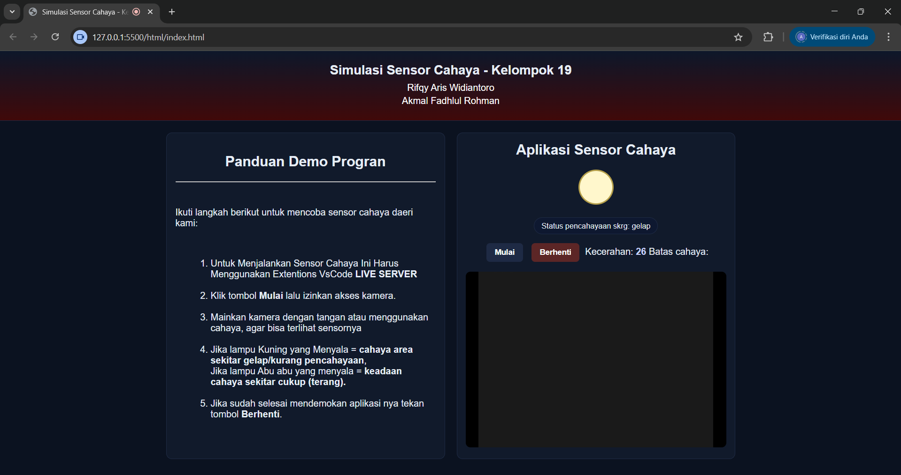
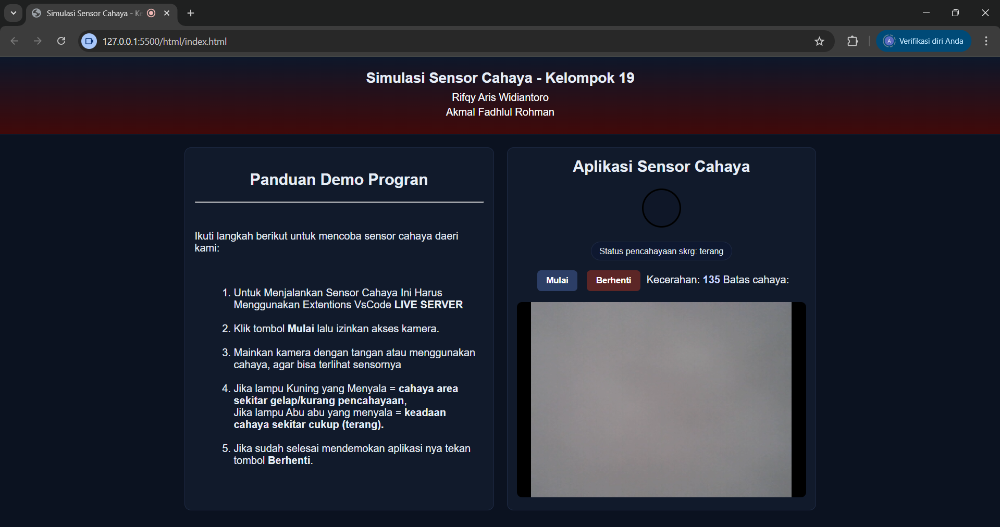

# FrontEnd-Kelompok-19 — Simulasi Sensor Cahaya

Proyek ini adalah tugas mata kuliah **Front-End**.  
Website yang kami buat berfungsi untuk **mensimulasikan sensor cahaya** dengan memanfaatkan kamera laptop. Saat kamera mendeteksi kondisi gelap, lampu virtual akan menyala, dan kalau kondisi terang lampunya akan mati.

---

## 👥 Anggota Kelompok 19
- Rifqy Aris Widiantoro  
- Akmal Fadhlul Rohman  

---

## 📷 Demo Program

**Saat kondisi gelap:**  


**Saat kondisi terang:**  



## 📂 Project Structure

FrontEnd-Kelompok-19/
├─ sensor-cahaya/
│  ├─ css/
        └─ style.css
│  ├─ html/                
│  │   └─ index.html
│  ├─ img/                
│  │   ├─ ss1.png
│  │   └─ ss2.png
│  ├─ javascript/        
│  │   └─ script.js
│  └─ README.md 

## 📌 Fitur Utama
- Menggunakan kamera laptop untuk membaca intensitas cahaya.  
- Lampu virtual otomatis:  
  - 🔆 Menyala kalau ruangan gelap.  
  - 🌑 Mati kalau ruangan terang.  
- Tampilan sederhana, interaktif, dan mudah dipakai.  

---

## 🛠️ Tech
- **HTML5** → struktur halaman  
- **CSS3** → styling tampilan  
- **JavaScript** → logika sensor dan kontrol lampu  

---

## 🚀 Cara Menjalankan
1. Clone repo ini:
   ```bash
   git clone https://github.com/akmals06/FrontEnd-Kelompok-19.git
